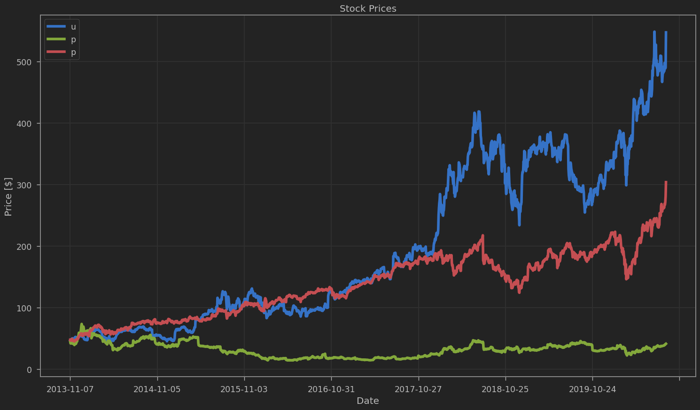
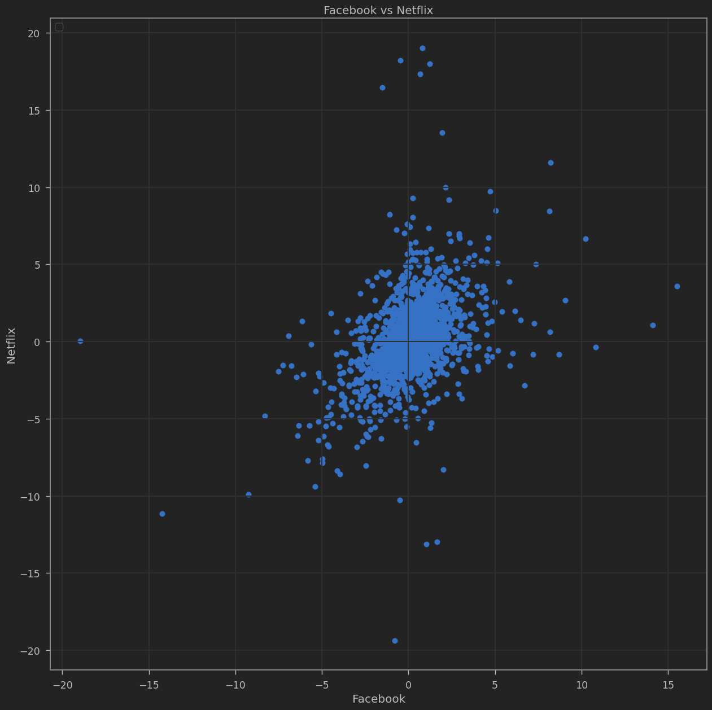
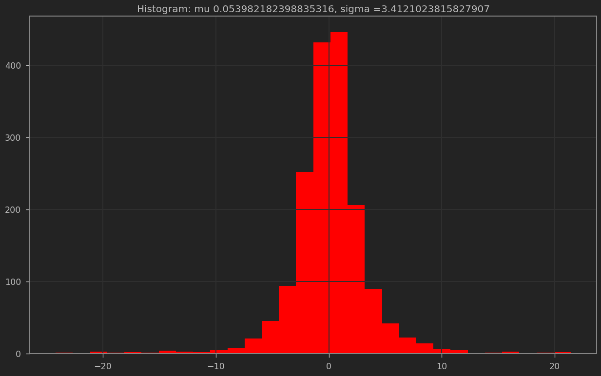
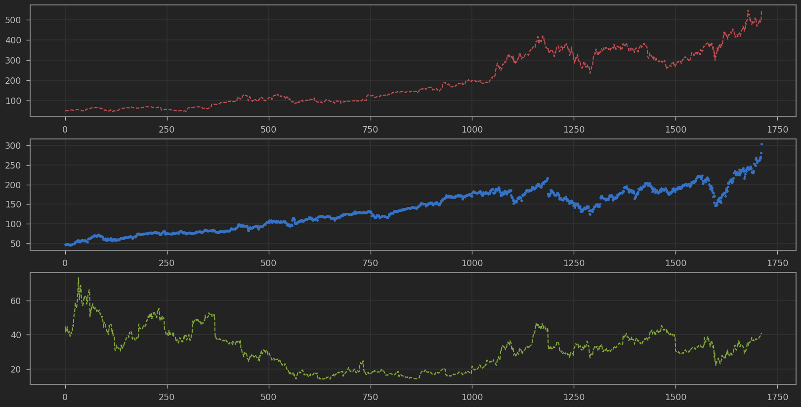
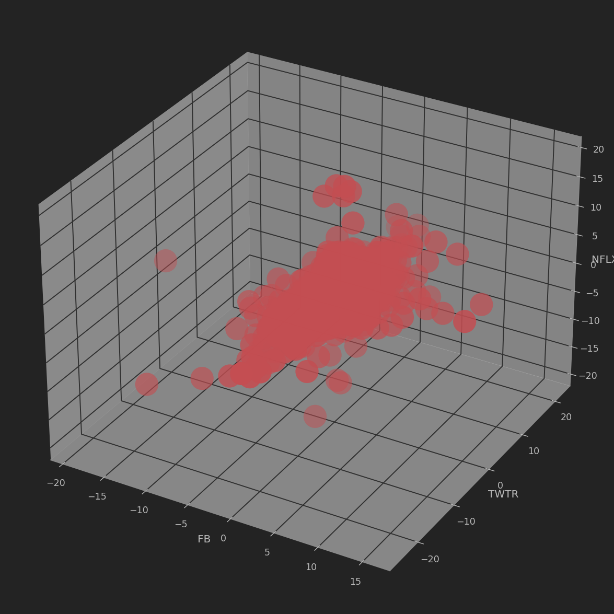

# Stock Market Data Visualization

**Exploring historical stock prices and daily returns for Facebook, Twitter, and Netflix using Python.**

## Overview

How do stock prices change over time, and what can data visualization reveal about daily market movements?

This project explores historical stock prices and daily returns for three major technology and entertainment companies: Facebook (FB), Twitter (TWTR), and Netflix (NFLX).

Using Python, Pandas, and Matplotlib, the analysis demonstrates several visualization techniques for examining financial time-series data, comparing stock performance, and exploring relationships between daily returns.

The project focuses on data exploration and visualization rather than predicting future stock prices.

## Dataset

The analysis uses two CSV datasets:

- `stock_data.csv` — Historical stock prices
- `stocks_daily_returns.csv` — Daily percentage returns

Both datasets contain 1,712 observations covering November 2013 through August 2020.

The datasets include observations for:

| Stock symbol | Company |
|---|---|
| FB | Facebook (now Meta Platforms) |
| TWTR | Twitter (now X) |
| NFLX | Netflix |

These are historical ticker symbols as represented in the original datasets.

## Exploratory Data Analysis

### Historical Stock Price Trends

Line plots were used to visualize historical stock prices and examine how individual stocks changed over time.

The analysis includes individual stock-price charts and combined plots comparing Facebook, Twitter, and Netflix.

These visualizations demonstrate how financial time-series data can be used to examine long-term price movements and differences between companies.

### Comparing Daily Stock Returns

Scatterplots were used to compare daily returns between different stocks, including:

- Facebook and Twitter
- Facebook and Netflix

These comparisons provide a visual way to explore whether daily movements in different stocks tend to follow similar patterns.

### Daily Return Distributions

Histograms were created to examine the distribution of daily returns.

The analysis also calculated the mean and standard deviation of returns, providing basic statistical context for the visualizations.

The notebook reported the following descriptive statistics:

| Stock | Mean daily return (%) | Standard deviation |
|---|---:|---:|
| Facebook | 0.129 | 2.034 |
| Twitter | 0.054 | 3.412 |

These statistics describe the historical observations in the provided dataset and are not forecasts of future returns.

### Comparing Multiple Stocks

Combined line plots and subplots were used to visualize stock prices for multiple companies.

This approach demonstrates different ways to present related time-series data, whether on a shared chart or in separate panels.

### Three-Dimensional Return Visualization

A 3D scatterplot was created using the daily returns of Facebook, Twitter, and Netflix.

This exercise explores how three numerical variables can be visualized together using Matplotlib's 3D plotting capabilities.

### Portfolio Allocation Visualization

The notebook also includes pie-chart exercises demonstrating hypothetical stock portfolio allocations.

These charts illustrate how proportions and category comparisons can be represented visually.

## Technologies Used

- **Python** — Data analysis and visualization
- **Pandas** — Loading and manipulating financial datasets
- **NumPy** — Numerical operations
- **Matplotlib** — Line plots, scatterplots, histograms, pie charts, and 3D visualizations
- **Jupyter Notebook** — Interactive analysis

## Skills Demonstrated

- Financial data exploration
- Time-series visualization
- Daily return analysis
- Descriptive statistics
- Multi-variable comparisons
- Histogram and scatterplot interpretation
- Multi-panel chart creation
- Three-dimensional visualization
- Data storytelling with Python

## Project Context

This project was completed as part of hands-on Python data visualization exercises.

It demonstrates foundational data analysis and visualization techniques using historical financial datasets. The notebook does not implement a stock-price forecasting model, trading strategy, or investment recommendation system.
